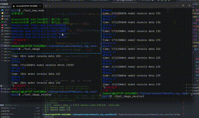

### hansolo_toy_core  

##### 对roscore的拙劣模仿  

###### 目前实现类似的功能

1. master和node通过gRpc实现远程过程调用，node和node之间通过tcp协议通信。  
2. hansolocore： 实现类似master的功能，对node进行管理调度
3. publish功能：自定义话题和数据类型发布消息，目前实现int型和图片类型
4. subscribe功能：接收发布者消息
5. 通过Protobuf实现自定义消息类型
6. hansolotopic：实现list查询话题功能 实现echo话题内容功能(暂时)

